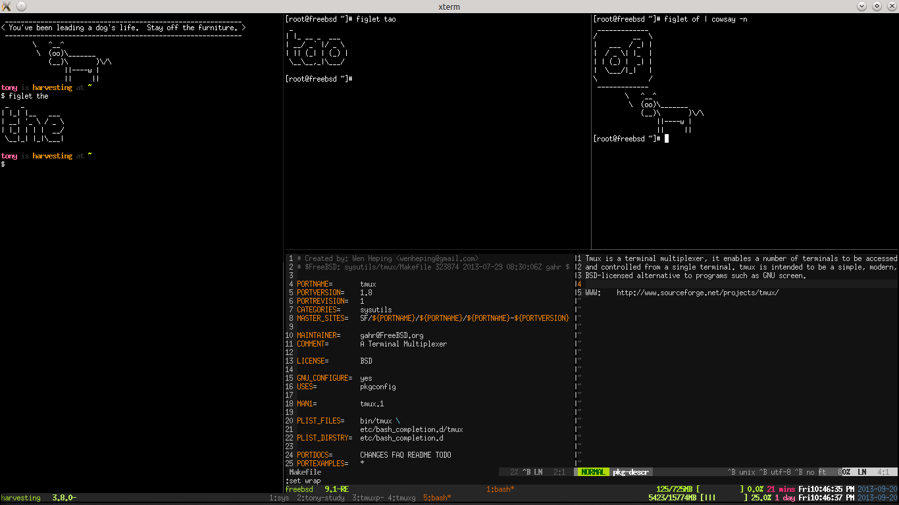

.. _about_tmux:

===============
The Tao of tmux
===============

    BSD-licensed terminal multiplexer.

tmux is geared for technical users who make heavy use of text-based
interfaces. If you are interested in starting to learn Linux / OS X better
as a future programmer or system administrator - welcome.

In the world of computers, there are many dimensions:

1. The text dimension
2. The graphical dimension

This is the text dimension. This is about fixed-width fonts and that old
fashioned black terminal.

tmux is to the console what a desktop is to gui apps. It's a world inside
the text dimension. Inside tmux you can:

- multitask inside of a terminal, run multiple applications
- have multiple command lines in the same window
- have multiple windows in the workspace
- switch between workspaces, like virtual desktops

Features
========

For terminals only. No graphics.
--------------------------------

uses:

- window-manager for text-based applications
- keep applications in a background process

A text-based window manager
---------------------------

=================== ====================== ===============================
**tmux**            **"Desktop"-Speak**    **Plain English**
------------------- ---------------------- -------------------------------
Multiplexer         Multitasking           Do more than one thing at once
Session             Desktop                Where stuff gets done
Window              Virtual Desktop or     Has windows inside
                    screen
Pane                Application            Performs operations
=================== ====================== ===============================

Multiple terminals to one screen
--------------------------------
It allows multiple applications or terminals to run at once.

Being able to run 2 or more terminals on one screen is convenient. This
way one screen can be used to edit a file, and another may be used to
``$ tail -F`` a logfile.

.. aafig::

   +--------+--------+
   | $ bash | $ bash |
   |        |        |
   |        |        |
   |        |        |
   |        |        |
   |        |        |
   |        |        |
   +--------+--------+

.. aafig::

   +--------+--------+
   | $ bash | $ bash |
   |        |        |
   |        |        |
   +--------+--------+
   | $ vim  | $ bash |
   |        |        |
   |        |        |
   +--------+--------+

You can create and remove as many terminal as you want.

It allows multiple layouts to view the apps
-------------------------------------------

Different applications are viewable better in different layouts.

It allows switching between layouts such as...

Organize apps based on your needs
---------------------------------
You can categorize and keep many terminals / applications separated into
multiple windows

In addition to being able to split the terminal into multiple panes, you
can create new windows as much as you want.

.. aafig::
   :textual:

   +---------+---------+                            +--------------------+
   | $ bash  | $ bash  |                            | $ vim              |
   |         |         |                            |                    |
   |         |         |    /-----------------\     |                    |
   +---------+---------+ -> |'switch-window 2'| ->  |                    |
   | $ vim   | $ bash  |    \-----------------/     |                    |
   |         |         |                            |                    |
   |         |         |                            |                    |
   +---------+---------+                            +--------------------+
   | '1:sys*  2:vim'   |                            | '1:sys  2:vim*'    |
   +-------------------+                            +--------------------+

You can switch between the windows you create.

Resume everything later
-----------------------

You can leave tmux and all applications running (detach), log out, make a
sandwich, and re-(attach), all applications are still running!

.. aafig::
   :textual:

   +--------+--------+                        +-----------------------+
   | $ bash | $ bash |                        | $ [screen detached]   |
   |        |        |                        |                       |
   |        |        |     /------------\     |                       |
   +--------+--------+ --> |   detach   | --> |                       |
   | $ vim  | $ bash |     | 'Ctrl-b b' |     |                       |
   |        |        |     \------------/     |                       |
   |        |        |                        |                       |
   +--------+--------+                        +-----------------------+
                                                           |
               +-------------------------------------------+
               |
               v
   +-----------------------+                        +--------+--------+
   | $ [screen detached]   |                        | $ bash | $ bash |
   | $ tmux attach         |                        |        |        |
   |                       |     /------------\     |        |        |
   |                       | --> | attaching  | --> +--------+--------+
   |                       |     \------------/     | $ vim  | $ bash |
   |                       |                        |        |        |
   |                       |                        |        |        |
   +-----------------------+                        +--------+--------+

Core Concepts
=============

Your workflow
-------------
You can keep tmux on a server with your latest work, come back and resume
your `"train of thought"`_ and work.

Multitasking. More important than any technical jargon - it's preserving
the thinking you have, whether you were in the midst of a one-off task, or
a common task.

If you do a task commonly, it may help to use an application which manages
tmux workspaces.

.. _"train of thought": http://en.wikipedia.org/wiki/Train_of_thought

.. _server:

Server
------

A server contains :ref:`session`'s.

tmux starts the server automatically if it's not running.

In advanced cases, multiple can be run by specifying ``[-L socket-name]``
and ``[-S socket-path]``.

.. _client:

Client
------

Attaches to a tmux :ref:`server`.

.. _session:

Session
-------

Inside a tmux :ref:`server`.
    
The session holds :ref:`window`. The bottom bar in tmux shows a list of
windows. Normally they can be navigated with ``Ctrl-a [0-9]``,
``Ctrl-a n`` and ``Ctrl-a p``.

.. aafig::
    :textual:

    +----------------------------------------------------------------+
    |  +--------+--------+ +-----------------+ +-----------------+   |
    |  | pane   | pane   | | pane            | | pane            |   |
    |  |        |        | |                 | |                 |   |
    |  |        |        | |                 | |                 |   |
    |  +--------+--------+ |                 | +-----------------+   |
    |  | pane   | pane   | |                 | | pane            |   |
    |  |        |        | |                 | |                 |   |
    |  |        |        | |                 | |                 |   |
    |  +--------+--------+ +-----------------+ +-----------------+   |
    |  | window          | | window          | | window          |   |
    |  \--------+--------/ \-----------------/ \-----------------/   |
    +----------------------------------------------------------------+
    | session                                                        |
    \----------------------------------------------------------------/

sessions can have a name.

uniquely identified by:

important attributes:

========================= ================================================
session_name
session_id
========================= ================================================

other attributes:

========================= ================================================
session_windows
session_width
session_height
session_created
session_created_string
session_attached
session_grouped
session_group
========================= ================================================

.. _window:

Window
------
inside a :ref:`session`.

holds panes.

panes can be organized with a layouts.

windows can have names.

.. _pane:

Pane
----
inside / Linked to a :ref:`window`.

a pty (pseudoterminal).

.. _target:

Target
------

a target, cited in the manual as ``[-t target]`` can be a session, window
or pane.
