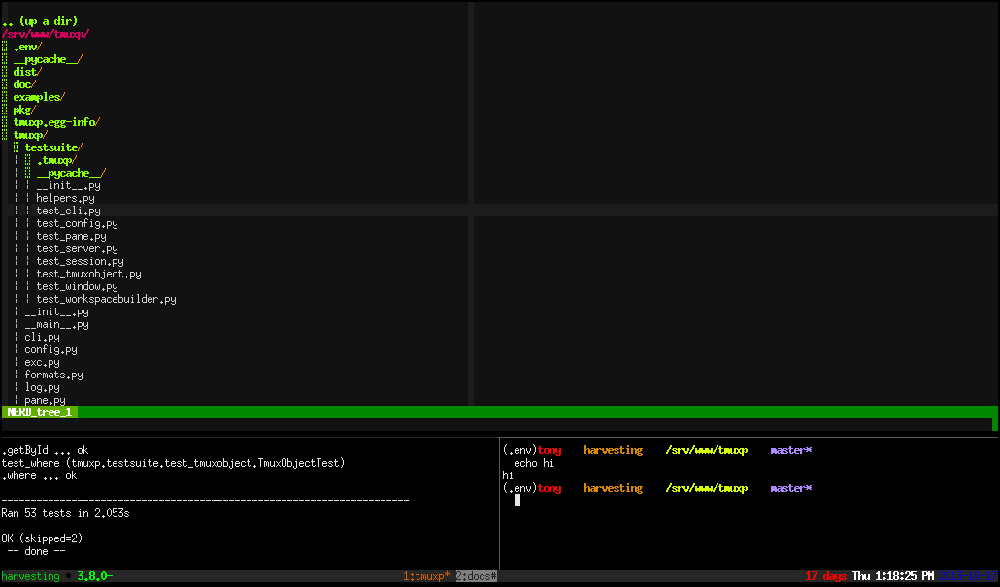

.. _developing:

======================
Developing and Testing
======================

.. todo::
    link to sliderepl or ipython notebook slides

Our tests are inside ``tests/``. Tests are implemented using
`pytest`_.

``make test`` will create a tmux server on a separate ``socket_name``
using ``$ tmux -L test_case``.

.. _pytest: http://pytest.org/

.. _install_dev_env:

Install the latest code from git
--------------------------------

Using pip
^^^^^^^^^

To begin developing, check out the code from github:

.. code-block:: bash

    $ git clone git@github.com:tmux-python/tmuxp.git
    $ cd tmuxp

Now create a virtualenv, if you don't know how to, you can create a
virtualenv with:

.. code-block:: bash

    $ virtualenv .venv

Then activate it to your current tty / terminal session with:

.. code-block:: bash

    $ source .venv/bin/activate

Good! Now let's run this:

.. code-block:: bash

    $ pip install -e .

This has ``pip``, a python package manager install the python package
in the current directory. ``-e`` means ``--editable``, which means you can
adjust the code and the installed software will reflect the changes.

.. code-block:: bash

    $ tmuxp

Using poetry
^^^^^^^^^^^^

To begin developing, check out the code from github:

.. code-block:: bash

    $ git clone git@github.com:tmux-python/tmuxp.git
    $ cd tmuxp

You can create a virtualenv, and install all of the locked
packages as listed in poetry.lock:

.. code-block:: bash

    $ poetry install

If you ever need to update packages during your development session, the
following command can be used to update all packages as per poetry settings or
individual package (second command):

.. code-block:: bash

    $ poetry update
    $ poetry update requests

Then activate it to your current tty / terminal session with:

.. code-block:: bash

    $ poetry shell

That is it! You are now ready to code!

Test Runner
-----------

As you seen above, the ``tmuxp`` command will now be available to you,
since you are in the virtual environment, your `PATH` environment was
updated to include a special version of ``python`` inside your ``.venv``
folder with its own packages.

.. code-block:: bash

    $ make test

You probably didn't see anything but tests scroll by.

If you found a problem or are trying to write a test, you can file an
`issue on github`_.

.. _test_specific_tests:

Test runner options
^^^^^^^^^^^^^^^^^^^

Test only a file:

.. code-block:: bash

    $ py.test tests/test_config.py

will test the ``tests/test_config.py`` tests.

.. code-block:: bash

    $ py.test tests/test_config.py::test_export_json

tests ``test_export_json`` inside of ``tests/test_config.py``.

Multiple can be separated by spaces:

.. code-block:: bash

    $ py.test tests/test_{window,pane}.py tests/test_config.py::test_export_json

.. _test_builder_visually:

Visual testing
--------------

You can watch tmux testsuite build sessions visually by keeping a client
open in a separate terminal.

Create two terminals:

  - Terminal 1: ``$ tmux -L test_case``
  - Terminal 2: ``$ cd`` into the tmuxp project and into the
    ``virtualenv`` if you are using one, see details on installing the dev
    version of tmuxp above. Then:

    .. code-block:: bash

        $ py.test tests/test_workspacebuilder.py

Terminal 1 should have flickered and built the session before your eyes.
tmuxp hides this building from normal users.

Run tests on save
-----------------

You can re-run tests automatically on file edit.

.. note::
    This requires ``entr(1)``.

Install `entr`_.  Packages are available available on most Linux and BSD
variants, including Debian, Ubuntu, FreeBSD, OS X.

To run all tests upon editing any ``.py`` file:

.. code-block:: bash

    $ make watch_test

You can also re-run a specific test file or any other `py.test usage
argument`_:

.. code-block:: bash

   $ make watch_test test=tests/test_config.py

   $ make watch_test test='-x tests/test_config.py tests/test_util.py'

Rebuild sphinx docs on save
---------------------------

Rebuild the documentation when an ``.rst`` file is edited:

.. code-block:: bash

   $ cd doc
   $ make watch

   # If you're not source'd via `poetry shell`, you can use this:
   $ make SPHINXBUILD='poetry run sphinx-build' watch

.. _tmuxp developer config:

tmuxp developer config
----------------------

After you :ref:`install_dev_env`, when inside the tmuxp checkout:

.. code-block:: bash

    $ tmuxp load .

this will load the ``.tmuxp.yaml`` in the root of the project.

.. literalinclude:: ../.tmuxp.yaml
    :language: yaml

.. _gh_actions:

Github Actions
--------------

tmuxp uses `github actions`_ for continuous integration / automatic unit
testing.

To view the tmux and python versions tested see the `.github/workflows/tests.yml`_.
Builds are done on ``master`` and pull requests and can be viewed on
the `gh build site`_.

Testing options
---------------

``RETRY_TIMEOUT_SECONDS`` can be toggled if certain workspace builder
tests are being stubborn.

e.g. ``RETRY_TIMEOUT_SECONDS=10 py.test``

.. literalinclude:: ../.github/workflows/tests.yml
    :language: yaml

.. _py.test usage argument: https://pytest.org/latest/usage.html
.. _entr: http://entrproject.org/
.. _github actions: https://github.com/features/actions
.. _gh build site: https://github.com/tmux-python/tmuxp/actions?query=workflow%3Atests
.. _.github/workflows/tests.yml: https://github.com/tmux-python/tmuxp/blob/master/.github/workflows/tests.yml
.. _issue on github: https://github.com/tmux-python/tmuxp/issues
